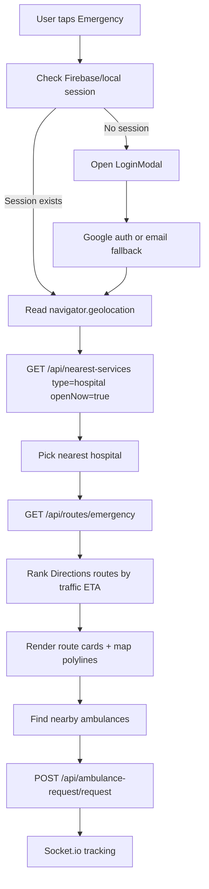
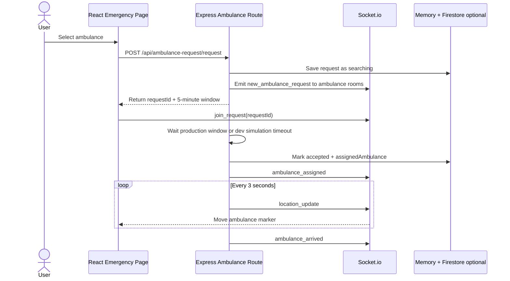
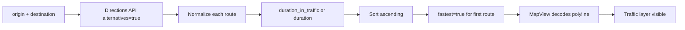
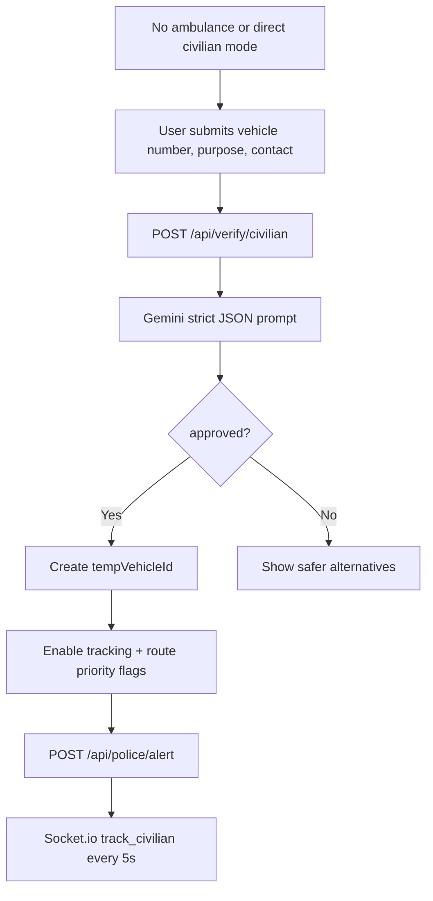
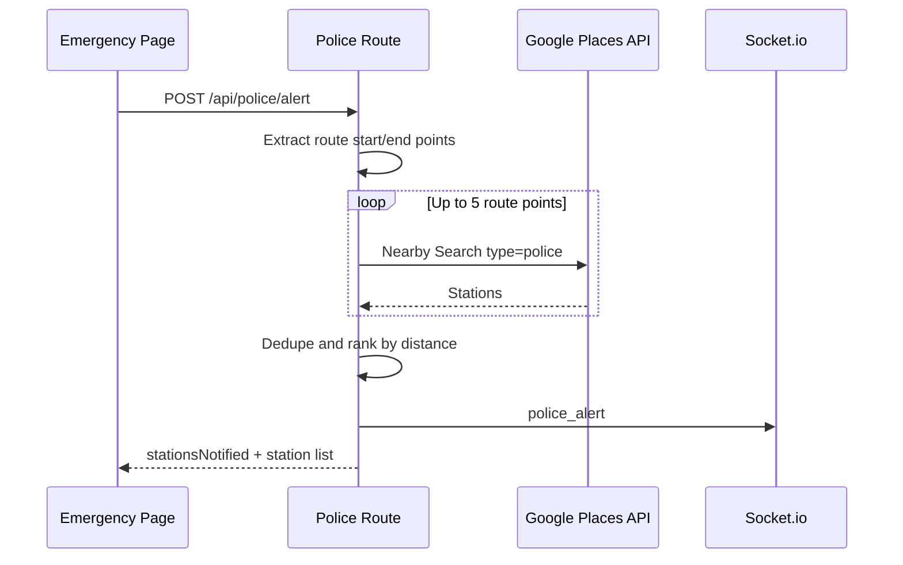
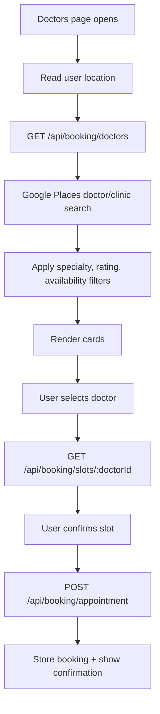
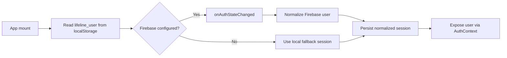
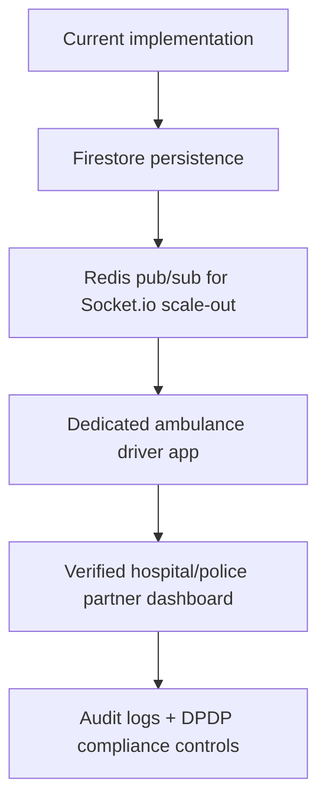

# 🧬 Core Logic & Emergency Pipelines

Core pipelines, process flows, and operational fundamentals for **LifeLine+**.

## 🚨 Emergency Pipeline

## 🚑 Ambulance Booking Logic

## 🗺️ Route Ranking Logic

## 🚗 Civilian Mode Verification

## 🚓 Police Alert Flow

## 🏥 Doctor Booking Flow

## 🔐 Auth Logic

## 📡 Realtime Notification Rules

| Trigger | Room | Event |
| --- | --- | --- |
| User signs into emergency page | `user_{userId}` | User-specific status updates |
| Ambulance request created | `ambulance_{ambulanceId}` | `new_ambulance_request` |
| Request screen active | `request_{requestId}` | Tracking updates |
| Driver accepted | `user_{userId}` and `request_{requestId}` | `ambulance_assigned` |
| Driver GPS changes | `user_{userId}` and `request_{requestId}` | `location_update` |
| Civilian tracking enabled | `civilian_{vehicleId}` | `civilian_location` |
| Police alert sent | Global | `police_alert` |

## 🧯 Failure Handling

| Failure | Recovery |
| --- | --- |
| Geolocation denied | Use Kolkata fallback coordinates and keep user informed |
| Google Places returns zero results | Show empty state or doctor fallback where applicable |
| Directions API fails | Keep destination selected and allow retry |
| Gemini returns invalid JSON | Deny civilian activation safely |
| Firebase Admin unavailable | Continue with in-memory state |
| Socket disconnects | Socket.io reconnects using websocket/polling transports |

## 🚀 Production Scaling Path

Connected docs: [README.md](README.md), [INSTRUCTIONS.md](INSTRUCTIONS.md), [ARCHITECTURE.md](ARCHITECTURE.md), and [LICENSE](LICENSE).
